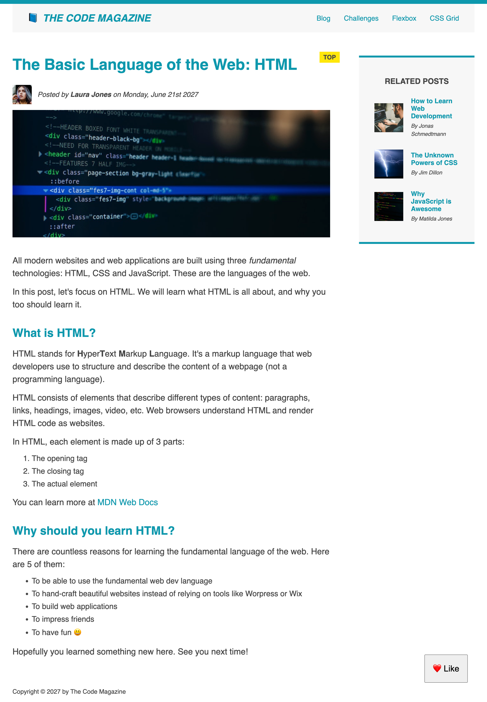

<h1> Blog Post </h1>

 Hi! This blog post was made during the Fundamental Sections of the "Build Responsive Real-World Websites with HTML and CSS" online course. 

 We first made the layout with Floats, then we changed it to Flexbox and finally ended with this beautiful post mixing Flexbox and CSS Grid. 

 (The pages flexbox.html and css-grid.html were used just to practice the concepts). 

<h3> Final Result: </h3>

 Made with 💖 by Marília Pacífico 

