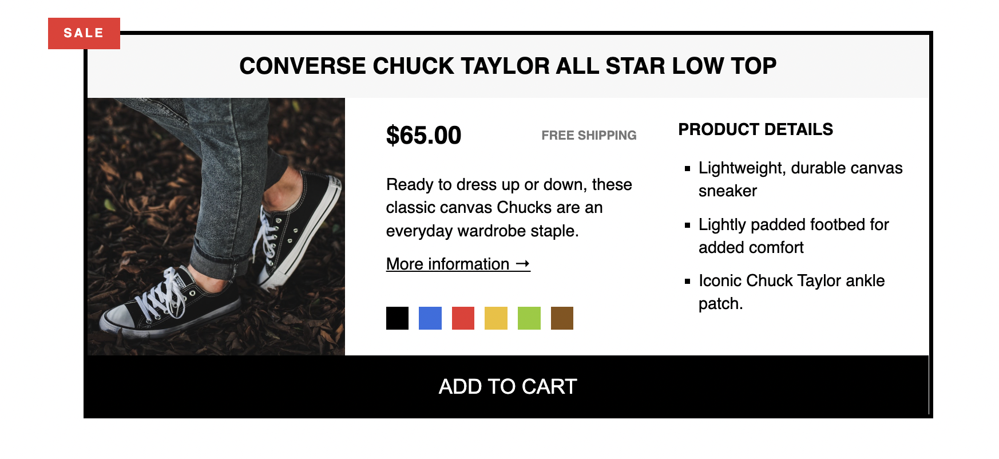

<h1> Coding Challenge </h1>

 Hello! This coding challenge is a basic product page for a Converse All Star. Its purpose was to put in practice the concepts that I'm learning during the course. It was first made using Floating, then we added Flexbox and then CSS Grid. 

<h3> Final Result: </h3>

 Made with 💖 by Marília Pacífico 

