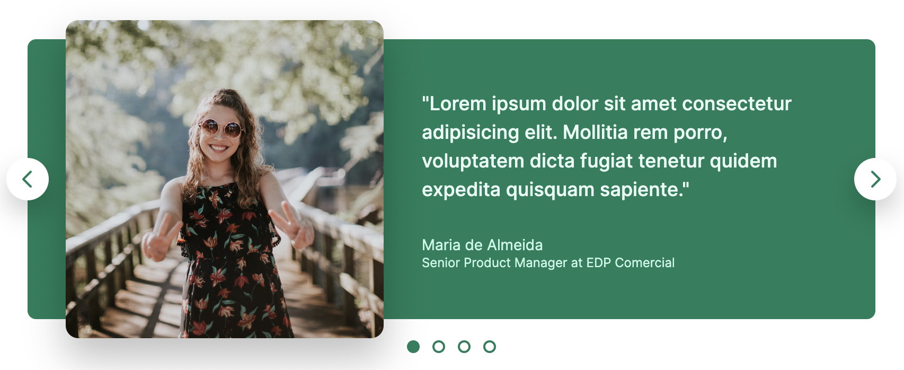

<h1> Layout Components </h1>

 Hello! These are some beautiful components we built in the Design Section of the "Build Responsive Real-World Websites with HTML and CSS" online course. 

<h3> Final Results: </h3> 

<h4> Accordion: </h4>

 

<h4> Carousel: </h4>
 

<h4> Table: </h4>
 

<h4> Pagination: </h4>
 

<h4> Hero Section: </h4>
 

<h4> Web Application (E-mail): </h4>
 

 Made with 💖 

